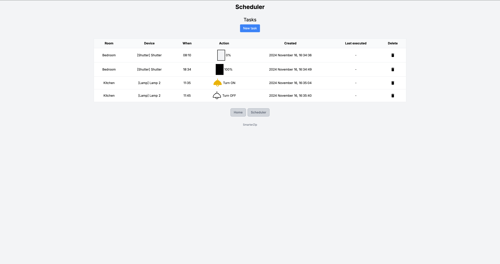

# SmarterZip

An unofficial web client for Zipato smart homes. The project was created to address limitations in the usability of Zipato’s web and mobile client.
The project is not publicly deployed by me, so if you’d like to use it, you’ll need to host it yourself or run it locally.

### Features

- Login page
  - You can log in with your Zipato account
- System selection page
  - Allows to choose from multiple systems
- Home page (rooms & devices)
  - Lamps
    - Toggle lamps on/off
    - The icon is yellow when lamps are on
  - Shutters
    - Displays current position (as a percentage and with an icon)
    - Allows raising or lowering shutters
    - Option to adjust shutters to 20% by clicking on the icon between the arrows
    - State refreshes automatically while adjusting
  - All states can be refreshed by clicking on the refresh icon (right side to the SmarterZip title)
  - All states refresh automatically every 60s
  - Simple responsive design
  - Rooms/devices can be renamed/ignored via config files
- Scheduler page
  - New scheduled tasks can be created
  - Tasks can be deleted
  - Each task will run once a day
  - Displays the last execution time for each task

### Limitations

Since this a personal project and Zipato doesn't have API documentation there were some features I either couldn't implement or didn't have time/motivation to do it.

- No thermostat support. My thermostats stopped sending data to the cloud (no idea why), so implementing this feature wasn’t feasible.
- Shutters can't be stopped mid-operation. I wasn't able to figure out how to implement this (maybe it's not possible).
- Single account and system support only, even though it looks it supports multiple.
- Single login across devices. Logging in on one device removes the need to login on others, as the server stores the authentication cookie.

### Used technologies

- FE: React, Nextjs, TypeScript, Tailwind CSS
- BE: Nodejs, Nextjs, TypeScript, SQLite

### Screenshots




### Demo video

https://www.youtube.com/watch?v=CPHo--McWzQ

https://www.youtube.com/watch?v=i53w90-4FZ4

### How to start (API & web client)

Create 3 configuration files based on the examples provided in src/app/api/config/\*.json.example

- src/app/api/config/devices.json - devices can be renamed (by device ID and name)
- src/app/api/config/ignoredDevices.json - put those devices (device ID) here which shouldn't be displayed
- src/app/api/config/rooms.json - configure all rooms to be shown on the homepage (by room ID and name)

Create an empty SQLite DB

```
sqlite3 smarterzip.sqlite3 "VACUUM;"
```

Configure the DB path in .env

- create the .env file from .env.example
- configure DATABASE_PATH

Install dependencies

```
npm i
```

Dev mode

```
npm run dev
```

Optimized production mode

```
npm run build
npm start
```

### How to start (scheduler)

Configuration

- Set it up similarly API & web client
- Ensure SCHEDULER_LOGIN\_\* variables match those used for logging into the web client

Dev mode

```
npm run scheduler:dev
```

Optimized production mode

```
npm run scheduler:build
npm run scheduler:prod
```

### Docker

```
HOST_PORT=6613 \
NEXT_PUBLIC_API_URL=http://yourip:6613/api
DATABASE_PATH=/Users/abc/dev/SmarterZip.sqlite3 \
DATABASE_LOGGING_ENABLED=false \
API_URL=http://web:3000/api \
SCHEDULER_LOGIN_EMAIL=mai@l.com \
SCHEDULER_LOGIN_PASSWORD=pass \
SCHEDULER_LOGIN_SYSTEM_UUID=id-ad-f \
docker-compose up --build -d
```

### Kubernetes / minikube

Load your local Docker images into minikube

```
minikube image load smarterzip-web:latest
minikube image load smarterzip-scheduler:latest
```

Create an empty SQLite DB

```
minikube ssh
sudo mkdir -p /mnt/data/databases/sqlite
touch SmarterZip.sqlite3
exit
```

Create resources

```
kubectl apply -Rf k8s/
```

Don't forget to change the secrets!

```
Use kubectl or minikube dashboard
```

Forward the web port if needed

```
kubectl port-forward svc/web 8484:3000 -n smarterzip
```

After this you can access the web on http://127.0.0.1:8484/
Don't forget to set NEXT_PUBLIC_API_URL=http://127.0.0.1:8484/api during Docker build

### License

The MIT License (MIT)
