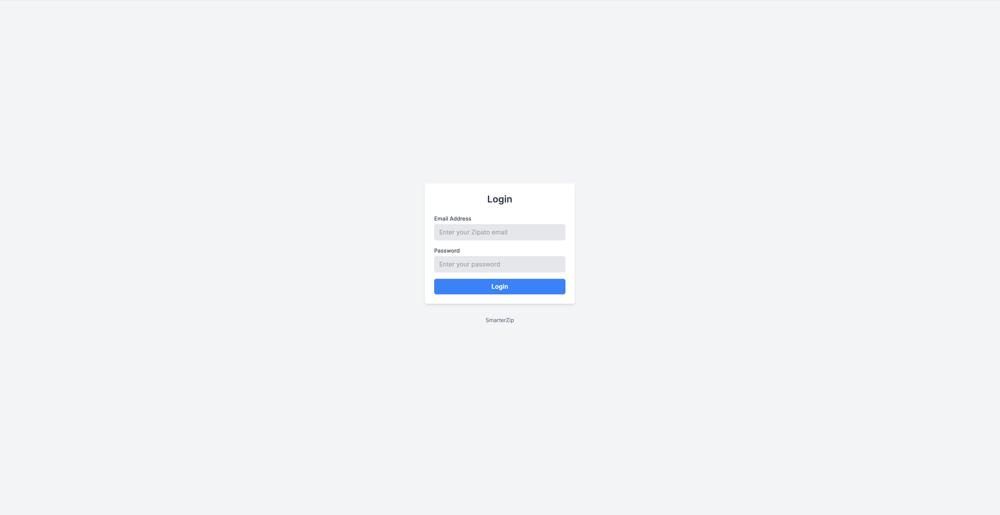
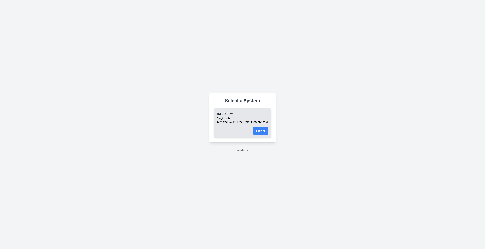
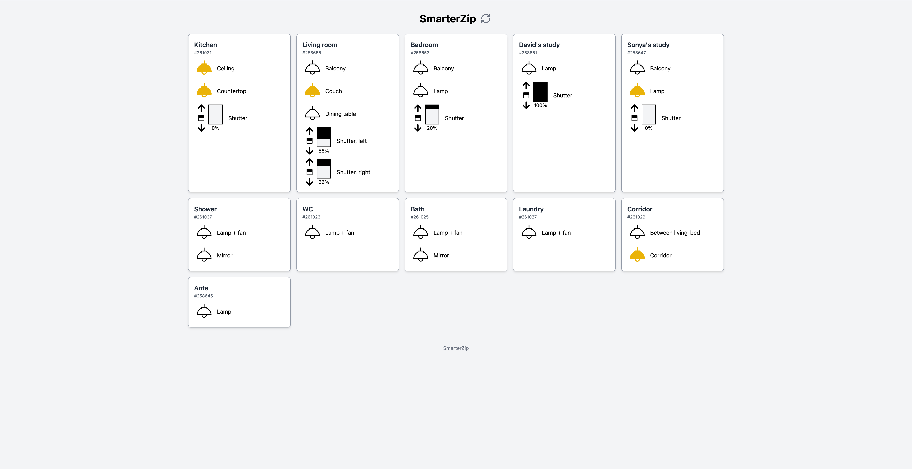
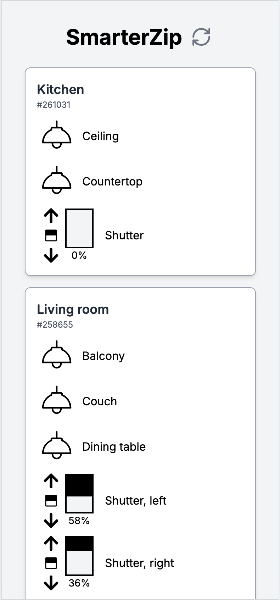
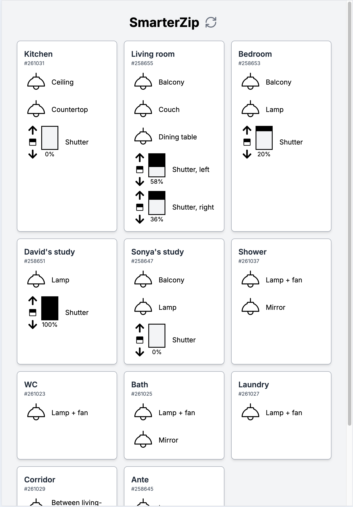

# SmarterZip

An unofficial web client for Zipato smart homes. The project was created to address limitations in the usability of Zipato’s web and mobile client.
The project is not publicly deployed by me, so if you’d like to use it, you’ll need to host it yourself or run it locally.

### Features

- Login page
  - You can log in with your Zipato account
- System selection page
  - Allows to choose from multiple systems
- Home page (rooms & devices)
  - Lamps
    - Toggle lamps on/off
    - The icon is yellow when lamps are on
  - Shutters
    - Displays current position (as a percentage and with an icon)
    - Allows raising or lowering shutters
    - Option to adjust shutters to 20% by clicking on the icon between the arrows
    - State refreshes automatically while adjusting
  - All states can be refreshed by clicking on the refresh icon (right side to the SmarterZip title)
  - All states refresh automatically every 60s
  - Simple responsive design
  - Rooms/devices can be renamed/ignored via config files

### Limitations

Since this a personal project and Zipato doesn't have API documentation there were some features I either couldn't implement or didn't have time/motivation to do it.

- No thermostat support. My thermostats stopped sending data to the cloud (no idea why), so implementing this feature wasn’t feasible.
- Shutters can't be stopped mid-operation. I wasn't able to figure out how to implement this (maybe it's not possible).
- Single account and system support only, even though it looks it supports multiple.
- Single login across devices. Logging in on one device removes the need to login on others, as the server stores the authentication cookie.

### Used technologies

- FE: React, Nextjs, TypeScript
- BE: Nodejs, Nextjs, TypeScript

### Screenshots







### Demo video

https://www.youtube.com/watch?v=CPHo--McWzQ

### How to start

Create 3 configuration files based on the examples provided in src/app/api/config/\*.json.example

- src/app/api/config/devices.json - devices can be renamed (by device ID and name)
- src/app/api/config/ignoredDevices.json - put those devices (device ID) here which shouldn't be displayed
- src/app/api/config/rooms.json - configure all rooms to be shown on the homepage (by room ID and name)

Dev mode

```
npm i
npm run dev
```

Optimized production mode

```
npm i
npm run build
npm start
```

### License

The MIT License (MIT)
